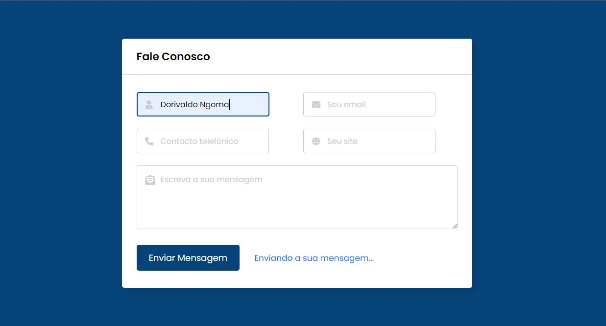

# Formulário de Contacto

## Sobre o projecto
 

Este projecto consiste na criação de um formulário para envio de e-mail de contacto utilizando as linguagens HTML, CSS e JavaScript para a parte do front-end e PHP para o envio de e-mail no lado do servidor.

Nota: O envio de e-mail com a função "mail" do PHP não funciona localmente.
